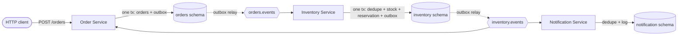

# AGENTS.md

Project context for AI coding agents. The human overview, endpoints, sample data, and
every Make target are in [README.md](README.md). The reasons behind the architecture are
in [docs/adr/](docs/adr/).

## Project

An event-driven order processing system in Go, built as a **learning project** for the
transactional outbox, concurrency control on shared inventory, idempotent consumers, and
Kafka delivery semantics. Understanding the mechanism matters as much as working code.

Flow: the Order Service accepts an order → the Inventory Service reserves stock → the
order's status is updated → the Notification Service sends a (mock) notification.
Services communicate only through Kafka topics.

**Status:** Step 1 (infrastructure and schema) and Step 2a (Go module skeleton, per-service
Postgres roles, import-boundary test) are done. Step 2b's design is settled: Gin for HTTP and
service-generated order IDs ([ADR-0011](docs/adr/0011-go-libraries-gin-uuid.md)), and a
hexagonal layout per service with the transaction as a port
([ADR-0012](docs/adr/0012-hexagonal-layout-per-service.md)). Next is #8, `POST /orders`
decoding and validation, test-first. The roadmap is in the README.

## Architecture

### Event flow



### Services

| | Order Service | Inventory Service | Notification Service |
|---|---|---|---|
| Kind | HTTP API + consumer | Consumer | Consumer |
| Postgres schema | `orders` | `inventory` | `notification` |
| Postgres role | `order_svc` | `inventory_svc` | `notification_svc` |
| Consumer group | `order-service` | `inventory-service` | `notification-service` |
| Consumes | `inventory.events` | `orders.events` | `inventory.events` |
| Produces (through its outbox) | `orders.events` | `inventory.events` | none |

- Each service connects as its own role (migration `000004`,
  [ADR-0002](docs/adr/0002-shared-database-schema-per-service.md)), whose `search_path` is its
  own schema, and refuses to start if `current_schema()` is anything else. Migrations,
  `make psql`, and `make seed` use the `orderflow` admin user.
- The Order Service consuming `inventory.events` is proposed (Open decisions #1).
- The Order and Notification services use **separate** consumer groups, so each receives
  every message on `inventory.events`.

### Runtime: what is shared

```
┌─ SEPARATE PROCESSES ──────────────────────────────────────────────────────────┐
│  order-service           inventory-service        notification-service        │
│  pool: order_svc         pool: inventory_svc      pool: notification_svc      │
│  group: order-service    group: inventory-service group: notification-service │
└───────────────────────────────────────────────────────────────────────────────┘
                     │ each process opens its own connections
                     ▼
┌─ SHARED SERVERS ──────────────────────────────────────────────────────────────┐
│  Postgres (1 instance): schemas orders, inventory, notification               │
│  Redpanda (1 cluster):  topics orders.events, inventory.events                │
└───────────────────────────────────────────────────────────────────────────────┘
  SHARED CODE     internal/platform is compiled into each program separately
  COMMUNICATION   Kafka topics only: no HTTP between services, no shared tables
```

| Layer | Shared? | Meaning |
|---|---|---|
| Servers | Yes, one of each | One Postgres instance and one Redpanda cluster |
| Source code | Yes, written once | `internal/platform` is built into every service |
| Runtime resources | Never | Each process owns its pool, Kafka client, credentials, and consumer group |
| Communication | Topics only | A service never calls another or reads its tables |

### Topics

| Topic | Producer | Consumers | Event types |
|---|---|---|---|
| `orders.events` | Order Service | Inventory Service | `order.created` |
| `inventory.events` | Inventory Service | Order Service, Notification Service | stock reserved / reservation failed (Open decisions #2) |

One topic per publishing service, with the event type in a message header, so all of an
order's events share one partition ([ADR-0009](docs/adr/0009-one-topic-per-publishing-service.md)).
The message key is the order ID. Each topic has 3 partitions and replication factor 1,
and is declared in `redpanda-init`; broker auto-creation is off. Message anatomy, each
event's payload, delivery guarantees, and failure behaviour are in
[docs/kafka.md](docs/kafka.md).

## Architecture invariants

Keep these true in every change. A change that would break one needs the user's
agreement and a new or superseding ADR.

1. Each service reads and writes only its own schema. Data crosses services only through
   events: no cross-schema foreign keys, joins, or queries.
   ([ADR-0002](docs/adr/0002-shared-database-schema-per-service.md))
2. A transaction touches exactly one service's schema.
   ([ADR-0002](docs/adr/0002-shared-database-schema-per-service.md))
3. A state change and its event commit in one transaction. The event is a row in that
   service's `outbox`, and only the outbox relay produces to Kafka.
   ([ADR-0003](docs/adr/0003-transactional-outbox.md))
4. The Kafka message key is the aggregate ID (the order ID).
   ([ADR-0003](docs/adr/0003-transactional-outbox.md))
5. Consumers dedupe on the event ID in the same transaction as the side effect, and
   commit the Kafka offset only after that transaction commits.
   ([ADR-0004](docs/adr/0004-idempotent-consumers.md))
6. Imports point one way: `cmd/<svc>` → `internal/<svc>` → `internal/platform`, and inside a
   service, adapters (`handler`, `consumer`, `repository`) → `service` → `domain`. `domain`
   imports only the standard library and `google/uuid`; `service` imports neither Gin nor
   pgx. `platform` holds mechanics only, with no business logic and no package-level state.
   `internal/archtest` enforces the import rules.
   ([ADR-0005](docs/adr/0005-single-module-shared-platform.md),
   [ADR-0012](docs/adr/0012-hexagonal-layout-per-service.md))
7. `inventory.products.available` keeps `CHECK (available >= 0)` as the backstop
   alongside application-level concurrency control.
8. The outbox relay is the only publish path, and it never publishes an event while an
   earlier event for the same aggregate is unpublished or parked.
   ([ADR-0006](docs/adr/0006-outbox-relay-polling-retries.md))

## Project structure

### Today

```
.
├── AGENTS.md              # this file: architecture, structure, conventions
├── CLAUDE.md              # imports this file; adds Claude's pair-programming role
├── README.md              # human overview, setup, endpoints, roadmap
├── go.mod, go.sum         # one module: github.com/kritpi/outbox-order-flow (ADR-0005)
├── cmd/                   # one main package per service: wiring only
├── internal/              # service packages and shared platform mechanics (below)
├── docs/adr/              # architecture decision records (NNNN-slug.md)
├── docs/database-schema.md  # ER diagrams (Mermaid) and role privileges, mirrors migrations/
├── docs/kafka.md            # topics, message flow, delivery semantics, failure cases
├── docker-compose.yml     # postgres, migrate, redpanda, redpanda-init, console
├── Makefile               # dev workflow; `make help` lists targets
├── migrations/            # golang-migrate: flat NNNNNN_<name>.up.sql / .down.sql pairs
└── db/seed/dev_seed.sql   # local-only fixtures
```

### Go code (ADR-0005, ADR-0012)

```
cmd/
  order-service/main.go         # wiring only: signals → config → pool → role check → components → close pool
  inventory-service/main.go
  notification-service/main.go
internal/
  order/                        # Order Service: config today; moves to the layout below in Step 2b
  inventory/                    # Inventory Service: config, Run loop (consumer in Step 4)
  notification/                 # Notification Service: config, Run loop (consumer in Step 5)
  platform/                     # shared mechanics: no business logic, no package-level state
    config/                     # env vars; reports every missing or invalid one at once
    pg/                         # pgxpool with a startup ping; Identity (current role and schema)
    shutdown/                   # SIGINT/SIGTERM context; Group: one component exits, all stop
    httpserver/                 # serve until the context ends, then drain with a timeout
  archtest/                     # import-boundary test
```

Each service takes a hexagonal layout when it gets real code: Order in Step 2b, Inventory in
Step 4, Notification in Step 5
([ADR-0012](docs/adr/0012-hexagonal-layout-per-service.md)).

```
internal/<svc>/
  handler/      inbound adapter: Gin routes, DTOs with binding tags, error → problem+json
  consumer/     inbound adapter for a Kafka topic (Inventory, Notification, Order in Step 5)
  service/      use cases, ports (interfaces incl. UnitOfWork and Repos), commands, event contracts
  domain/       business types and rules, typed errors; stdlib + google/uuid only
  repository/   outbound adapter: pgx, row entities, UnitOfWork over platform/pg.WithTx
```

- **Kafka is never a service port.** A use case emits an event by writing an outbox row through
  its repository, in its transaction. Consumers are inbound adapters, and only the relay in
  `platform/outbox` produces.
- **The transaction is a port:** `uow.Do(ctx, isolation, func(service.Repos) error)`.
  Isolation is always explicit, nothing inside does network I/O, and repositories exist only
  inside `Do`.

Not created until the step that first uses them: `platform/outbox` (Step 2b: the shared
outbox `Insert`; Step 3 adds the relay: poll → publish → mark), `platform/kafka` (Step 3),
and `platform/consumer` (Step 4, the idempotent loop: dedupe + transaction + offset commit).

```
cmd/<svc> ──► internal/<svc> ──► internal/platform
internal/inventory ──✗──► internal/order      (no service imports another)
internal/platform  ──✗──► internal/<svc>      (plumbing never imports business code)
```

Event contracts are defined by each consumer, so there is no shared `internal/events`
package ([ADR-0007](docs/adr/0007-event-contracts-consumer-defined.md)). `internal/archtest`
fails on any new top-level `internal/` package until it has an import rule. Where service
container files live is still open (Open decision #4).

## Conventions

### Database

- Migrations use golang-migrate in a **flat** `migrations/` directory of
  `NNNNNN_<name>.up.sql` / `.down.sql` pairs. golang-migrate reads one directory and pairs
  files by version, so subdirectories break `make up`. Create a pair with
  `make migrate-new name=<snake_case>`. Once a migration is committed, change the schema
  with a new migration rather than editing the old one.
- Tables live in their service's schema. A publishing service has its own `outbox`; a
  consuming service has its own dedupe table.
- Business IDs (order IDs) are UUIDv7 generated by the service and have no column default, so
  a forgotten ID fails the insert. Outbox event IDs stay `DEFAULT uuidv7()`, because the relay
  orders by them and one database clock can't skew
  ([ADR-0011](docs/adr/0011-go-libraries-gin-uuid.md)). Timestamps are `timestamptz`, and states are `text` with
  a `CHECK` constraint rather than enum types (a `CHECK` is easy to change in a
  migration).
- Every non-obvious column, constraint, or index gets a comment explaining why, as in
  the existing migrations.
- A migration that changes tables, keys, or constraints updates the ER diagrams in
  [docs/database-schema.md](docs/database-schema.md) in the same change.
- Dev fixtures go in `db/seed/` and stay idempotent (`ON CONFLICT … DO UPDATE`).

### Broker

- A new topic goes into the `redpanda-init` loop in `docker-compose.yml`, created with
  `--if-not-exists`.
- Each service consumes with its own named consumer group. `make consume` reads without
  a group, so it never moves a service's offsets.
- A change to topics, partition counts, message format, or delivery behaviour updates
  [docs/kafka.md](docs/kafka.md) in the same change.

### Go

- Libraries: `jackc/pgx/v5` for Postgres, `twmb/franz-go` for Kafka (added in Step 3), Gin
  with its binding and validator for HTTP, `google/uuid` for order IDs, and the standard
  library for logging, config, and shutdown
  ([ADR-0011](docs/adr/0011-go-libraries-gin-uuid.md)). Any other dependency is a checkpoint.
- HTTP services use `gin.New()` with `Recovery` and an `slog` request logger, and read
  `GIN_MODE` through `LoadConfig`. `main` sets `binding.EnableDecoderDisallowUnknownFields =
  true`, the one allowed package-level global: ADR-0010's replay check needs unknown fields
  rejected.
- Request shape is checked by DTO `binding` tags; business rules by the domain constructor.
  Malformed requests are 400, invalid values 422, all as RFC 9457 problem+json from one
  error-mapping function in `handler`.
- Work test-first (red → green → refactor), per layer: pure tests for `domain`, a fake
  `UnitOfWork` for `service`, `httptest` on a `gin.Engine` for `handler`, and integration
  tests for `repository` against the `make up` Postgres behind the `integration` build tag.
  Integration tests use a fresh random `customer_id` rather than cleaning up (service roles
  have no DELETE).
- `main` only wires. It owns every pool and client, runs long-lived components in a
  `shutdown.Group`, and closes the pool after the group has stopped.
- Each service reads its environment in `internal/<svc>.LoadConfig` through
  `platform/config`, which reports every missing or invalid variable at once.
- Event payload types are defined by each consumer, with no shared events package
  ([ADR-0007](docs/adr/0007-event-contracts-consumer-defined.md)).
- `make test` runs `go test -race ./...`, including the import-boundary test; `make vet`
  runs `go vet`. `make test-integration` (added with the first repository test) runs the
  `integration`-tagged tests against the running stack.

### General

- Pin exact versions for container images and Go modules.
- Comments explain *why*: the mechanism or trade-off.
- Verify before reporting. Run the stack, the relevant queries or `make consume`, and the
  tests. Show the output and say what stayed unverified.
- Keep docs in sync within the same change:
  - An architecture or structure change → this file and the README.
  - A decision that is hard to reverse, surprising, and the result of a real trade-off → a
    new ADR with the next number. Supersede an accepted ADR rather than rewriting it.
  - A finished step → tick it in the README roadmap.
- Commit only when the user asks.

## Setup

```bash
make up          # Postgres + Redpanda, migrations, topics; waits for the one-shot containers
make seed        # sample inventory (idempotent)
make test        # unit tests with -race, including the import-boundary test
make run-order   # Order Service on :8080 (also run-inventory, run-notification)
make help        # every target
```

Go services running on the host connect to Postgres at `localhost:5432`, each as its own
role (the Makefile's `svc_db_url` builds the URLs), and to Kafka at `localhost:19092`. Containers use `postgres:5432` and `redpanda:9092`. Redpanda
advertises a different address per listener, so a client given the wrong one reaches
the first broker and then fails when it reconnects. Console UI: http://localhost:8090.

A healthy stack: in `make ps`, postgres and redpanda are healthy and migrate and
redpanda-init show `Exited (0)`. `make migrate-version` prints the latest migration
number.

## Open decisions

Settle each one at the checkpoint where it first matters. When one is settled, write an ADR
if it meets the bar above, update this file and the README, and delete the item here. Items
keep their numbers when others are deleted, because issues and docs cite them by number.

- **#1 Order status owner** (Step 5). Proposed: the Order Service consumes `inventory.events` and
  updates its own `orders.orders`. The original brief had the Notification Service write
  it.
- **#2 Inventory event names** (Step 4). Proposed: name them as facts in the publisher's domain
  (`inventory.reserved`, `inventory.reservation_failed`). The brief used
  `order.reserved` / `order.failed`.
- **#4 Service containers** (after Step 5). Proposed: services run on the host with `go run` through
  Step 5. After that, add a Dockerfile plus one compose file per service, pulled into the
  root file with `include:`.
