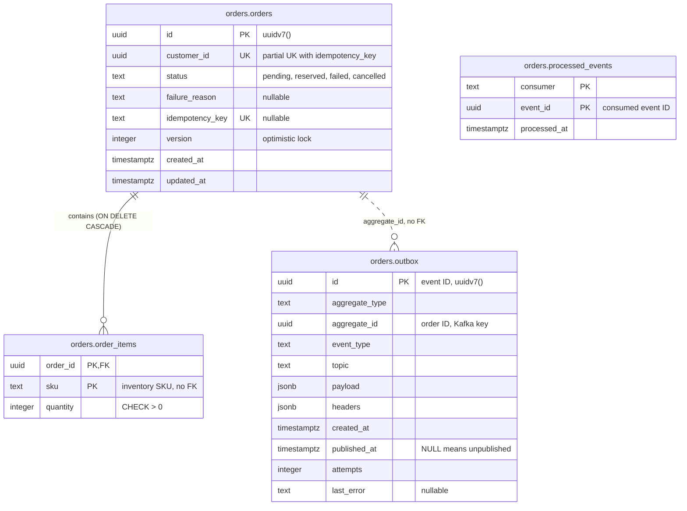
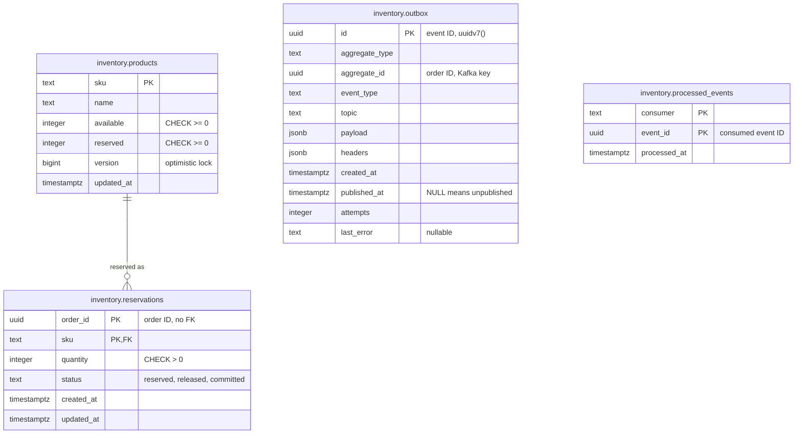
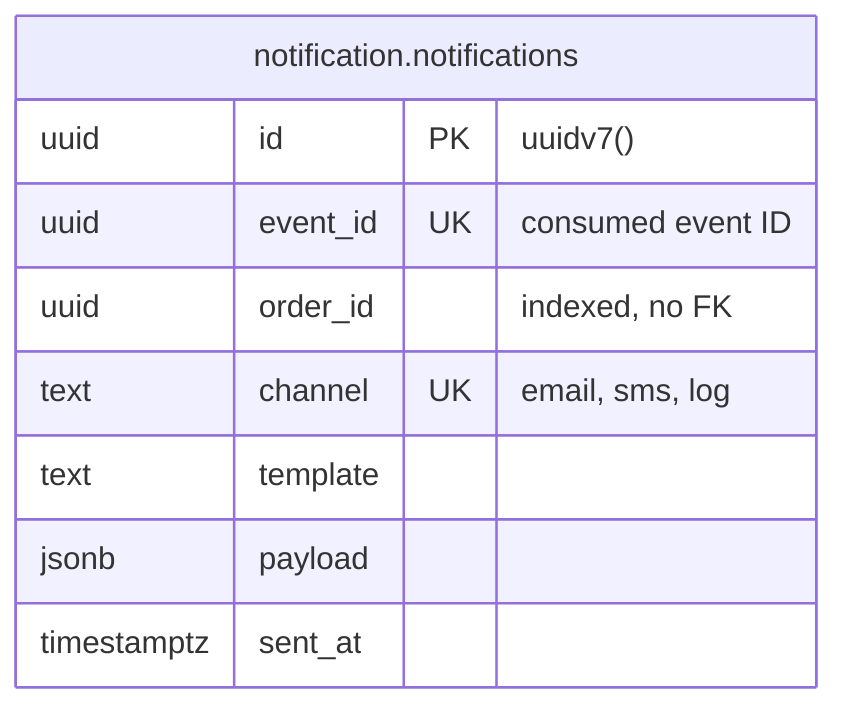
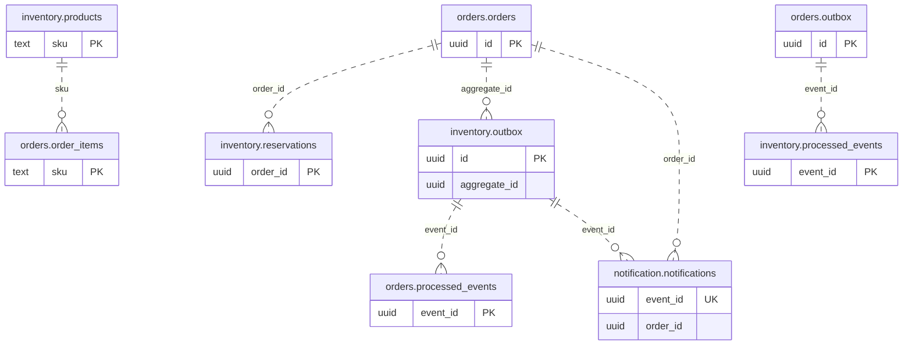

# Database schema

Entity-relationship diagrams for the `orderflow` database as of migration `000003`. The
SQL in [`migrations/`](../migrations/) is the source of truth; update this file in the
same change as any migration.

The database has one schema per service
([ADR-0002](adr/0002-shared-database-schema-per-service.md)). golang-migrate's own
`public.schema_migrations` table is not shown.

## Reading the diagrams

| Notation | Meaning |
|---|---|
| **Solid line** | A foreign key enforced by Postgres. Only two exist, and both stay inside one schema. |
| **Dashed line** | A reference by ID with **no** foreign key. It either crosses a service boundary or points from an outbox row to its aggregate. Events and application code keep it consistent, not the database. |
| `PK` / `FK` / `UK` | Primary key, foreign key, unique key. Every column of a composite key carries the marker. |
| Line ends | Crow's foot notation: a double bar means exactly one; a circle with a fork means zero or more. |

## `orders` schema (Order Service)

| Table | Constraints and indexes the diagram can't show |
|---|---|
| `orders.orders` | `CHECK status IN (…)`; `UNIQUE (customer_id, idempotency_key) WHERE idempotency_key IS NOT NULL`; index `(customer_id, created_at DESC)` |
| `orders.order_items` | `order_id` → `orders.orders(id) ON DELETE CASCADE`; `CHECK quantity > 0` |
| `orders.outbox` | Partial index `(id) WHERE published_at IS NULL`, so relay polling stays cheap as published history grows |
| `orders.processed_events` | Composite PK `(consumer, event_id)` is the dedupe guard |

## `inventory` schema (Inventory Service)

| Table | Constraints and indexes the diagram can't show |
|---|---|
| `inventory.products` | `CHECK available >= 0` and `CHECK reserved >= 0`: the database-level backstop against overselling |
| `inventory.reservations` | `sku` → `inventory.products(sku)` (default `NO ACTION`: a product with reservations can't be deleted); `CHECK quantity > 0`; `CHECK status IN (…)` |
| `inventory.outbox` | Partial index `(id) WHERE published_at IS NULL` |
| `inventory.processed_events` | Composite PK `(consumer, event_id)` is the dedupe guard |

## `notification` schema (Notification Service)

The Notification Service publishes nothing, so it has no outbox. Its dedupe guard is the
unique key on the notification log itself.

| Table | Constraints and indexes the diagram can't show |
|---|---|
| `notification.notifications` | `UNIQUE (event_id, channel)`, so a redelivered event can't notify the same channel twice; `CHECK channel IN (…)`; index `(order_id)` |

## References between services

These are the links that events carry instead of foreign keys. Only key columns are
shown, and every line is dashed.

| Reference | Carried by |
|---|---|
| `orders.orders.id` → `inventory.reservations.order_id` | the `order.created` message |
| `orders.order_items.sku` → `inventory.products.sku` | the `order.created` message (its line items) |
| `orders.outbox.id` → `inventory.processed_events.event_id` | the event ID of each `orders.events` message |
| `orders.orders.id` → `inventory.outbox.aggregate_id` | the reservation result, keyed by order ID |
| `inventory.outbox.id` → `orders.processed_events.event_id` | the event ID of each `inventory.events` message, if the Order Service owns status updates (AGENTS.md open decision #1) |
| `inventory.outbox.id` → `notification.notifications.event_id` | the event ID of each `inventory.events` message, one row per channel |
| `orders.orders.id` → `notification.notifications.order_id` | the reservation result's payload |

Nothing in the database enforces these references, so a dangling one is possible. An
`order.created` for an unknown SKU, for example, arrives at the Inventory Service and
must become a reservation failure in code. It can't be rejected by a constraint.
