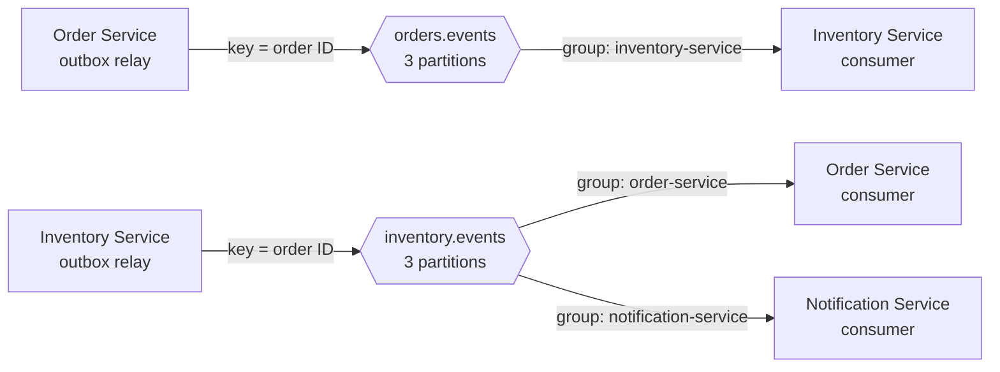
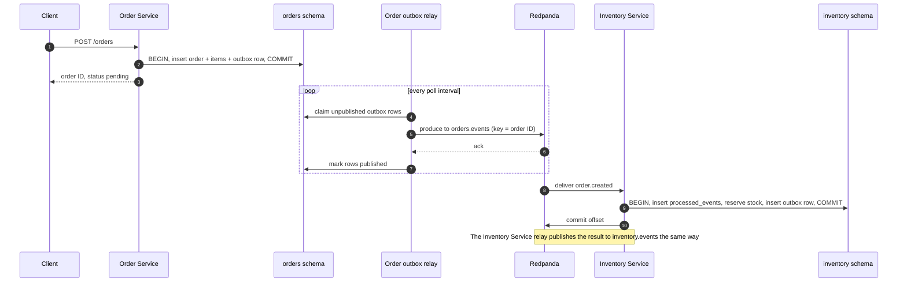

# Kafka messaging

How events move between services: topics, keys and partitions, consumer groups, delivery
guarantees, and what happens when something fails.

- **Settings** in this document were read from the running broker (Redpanda v26.2.2).
- **Design** comes from [ADR-0001](adr/0001-kafka-protocol-via-redpanda.md) (Kafka protocol),
  [ADR-0003](adr/0003-transactional-outbox.md) (outbox),
  [ADR-0004](adr/0004-idempotent-consumers.md) (idempotent consumers), and
  [ADR-0006](adr/0006-outbox-relay-polling-retries.md) (outbox relay).
- Anything marked **proposed** is still an open decision in
  [AGENTS.md](../AGENTS.md#open-decisions) and gets settled at the checkpoint named.

**Status:** both topics exist and are empty. No producers or consumers exist until the Go
services arrive (Step 2 onward).

## At a glance



Producers are on the left, topics in the middle, and consumers on the right, each labelled
with its consumer group.

Only an **outbox relay** ever produces to Kafka; request handlers and consumers write to
their own outbox table instead. The Order Service consuming `inventory.events` is proposed
(open decision #1).

## Topics

| Topic | Producer | Consumer groups | Event types | Partitions | Replicas |
|---|---|---|---|---|---|
| `orders.events` | Order Service relay | `inventory-service` | `order.created` | 3 | 1 |
| `inventory.events` | Inventory Service relay | `order-service` (proposed), `notification-service` | stock reserved / reservation failed (names: open decision #2) | 3 | 1 |

There is one topic per publishing service, and the event type travels in a header. That
layout is implemented but still open (decision #3). Topics are declared in the
`redpanda-init` job in [`docker-compose.yml`](../docker-compose.yml).

### Topic configuration

Both topics use broker defaults; nothing is overridden per topic.

| Setting | Value | What it means here |
|---|---|---|
| `cleanup.policy` | `delete` | Old segments are deleted by age. Nothing is compacted per key. |
| `retention.ms` | `604800000` (7 days) | A message is deleted 7 days after being written, whether or not anyone consumed it. |
| `retention.bytes` | `-1` | No size limit; retention is by time only. |
| `max.message.bytes` | `1048576` (1 MiB) | An event larger than this is rejected at produce time. Keep payloads small. |
| `compression.type` | `producer` | The broker stores whatever compression the producer used. |
| `message.timestamp.type` | `CreateTime` | A message's timestamp is the one the producer set, not the time the broker received it. |

### Broker settings that affect this project

| Setting | Value | What it means here |
|---|---|---|
| `auto_create_topics_enabled` | `false` | Producing to a topic that doesn't exist fails. Set by `redpanda-init`. |
| `enable_idempotence` | `true` | Idempotent producers are available (see [Settings still to decide](#settings-still-to-decide)). |
| `enable_transactions` | `true` | Available but unused: Kafka transactions can't include a Postgres commit (ADR-0004). |
| `group_offset_retention_sec` | `604800` (7 days) | A consumer group with no active members loses its committed offsets after 7 days. |
| `group_initial_rebalance_delay` | `0` | A new group starts consuming immediately rather than waiting for more members. |
| Write caching (`write.caching=true`) | on | Dev-container mode acknowledges writes before they're flushed to disk. A hard broker crash can lose recently acknowledged messages. **Local development only.** |

## Message anatomy

Each message is built from one outbox row. The key and the source of each field are
decided; header names and payload shape are **proposed** and settle at the Step 2 and 3
checkpoints (open decision #5).

| Part | Content | From outbox column | Status |
|---|---|---|---|
| Key | Order ID (UUID string) | `aggregate_id` | Decided (ADR-0003) |
| Value | JSON event payload | `payload` | JSON decided; shape proposed |
| Header `event_id` | Outbox row ID (`uuidv7`), used by consumers for dedupe | `id` | Needed by ADR-0004; name proposed |
| Header `event_type` | e.g. `order.created` | `event_type` | Proposed (tied to decision #3) |
| Header `aggregate_type` | `order` | `aggregate_type` | Proposed |
| Other headers | Trace IDs and similar, copied through | `headers` | Proposed |
| Timestamp | When the event was recorded | `created_at` | Proposed |

An illustrative `order.created` (not a final contract):

```
topic:   orders.events   partition: hash(key) mod 3
key:     0199a3c2-7f10-7b4e-9c2d-5e8f1a2b3c4d
headers: event_id=0199a3c2-7f11-70aa-8d01-2f3e4a5b6c7d
         event_type=order.created
         aggregate_type=order
value:   {"order_id":"0199a3c2-7f10-7b4e-9c2d-5e8f1a2b3c4d",
          "customer_id":"0199a3c2-6e00-7c11-a0b1-c2d3e4f5a6b7",
          "items":[{"sku":"SKU-KEYBOARD","quantity":2}]}
```

## Keys, partitions, and ordering

The partition is `hash(key) mod partition count`, so **every event for one order lands on
the same partition**, in the order it was produced. Kafka guarantees ordering only within a
partition, and only when both of these hold:

1. **Events for one order are produced in order.** This is the relay's job: it never
   publishes an event while an earlier event for the same order is still unpublished
   ([ADR-0006](adr/0006-outbox-relay-polling-retries.md)). Keeping that rule with several
   relay instances claiming rows via `FOR UPDATE SKIP LOCKED` is the Step 3 checkpoint.
2. **The consumer processes each partition sequentially.** Processing messages from one
   partition in parallel gives up per-order ordering.

Events for *different* orders may land on different partitions and have no relative
order. That's fine: independent orders don't depend on each other.

**Keep the partitioner and the partition count fixed:**
- All producing goes through one relay implementation in `internal/platform/outbox`, so
  every producer uses the same partitioner. Kafka clients don't all hash keys the same
  way, and mixing clients would send one order's events to different partitions.
- Changing a topic's partition count remaps keys to partitions. Events for an existing
  order could then land on a new partition and be consumed before older ones. Treat a
  partition change as a migration that needs a checkpoint, not a config tweak.

## Consumer groups

- **Between services, every group gets every message.** The Order Service and the
  Notification Service each read all of `inventory.events` independently, because they use
  different groups.
- **Within one service, partitions are shared out.** Running two Inventory Service
  instances in the `inventory-service` group gives, for example, partitions 0 and 1 to one
  instance and partition 2 to the other.
- **At most 3 instances per group do work.** There are 3 partitions; a fourth instance sits
  idle until another leaves.
- **A rebalance moves partitions.** When an instance joins, leaves, or crashes, its
  partitions go to others. Messages it processed but hadn't committed offsets for are
  delivered again to the new owner, and the dedupe key makes that harmless.

## Outbox relay

Decided in [ADR-0006](adr/0006-outbox-relay-polling-retries.md); the code arrives in
Step 3.

| Aspect | Behaviour |
|---|---|
| Wake-up | Every 250 ms (configurable); again immediately while batches come back full; when the earliest retry is due |
| Claim | Due, unpublished rows in `id` order, skipping rows whose order still has an earlier unpublished event |
| Success | `published_at = now()` once the broker acknowledges |
| Transient failure | `attempts + 1`, `last_error`, `next_attempt_at = now() + min(60 s, 1 s × 2^attempts)` plus jitter; retried indefinitely |
| Failure retrying can't fix | Row parked (no more retries) with an alert; that order's later events wait behind it |
| Health signals | Outbox lag (age of the oldest unpublished row) and the parked-row count |

`next_attempt_at` and the parked marker don't exist yet; migration `000004` adds them. A
`LISTEN/NOTIFY` wake-up and a Debezium CDC relay are stretch steps on the roadmap.

## Delivery guarantees, end to end



| Step | Guarantee | Why |
|---|---|---|
| API → `orders` schema | Atomic | Order, items, and outbox row commit in one transaction |
| Outbox → Kafka | At-least-once | The relay publishes, then marks; a crash in between republishes |
| Kafka → consumer's database | Effectively once | Dedupe row in the same transaction as the effect; offset committed after |
| Consumer → outside world (a real email) | At-least-once | An external call can't join a Postgres transaction |

## Failure scenarios

| What fails | What happens | Why nothing is lost or doubled |
|---|---|---|
| Broker is down when an order is placed | The order and its outbox row commit; the relay retries with capped backoff until the broker is back | The API never talks to Kafka directly |
| Relay crashes after producing, before marking published | Those rows are published again on restart | Consumers drop the duplicates by `event_id` |
| An event can never be published (e.g. larger than 1 MiB) | The relay parks the row and alerts; later events for that order wait behind it | **Needs a person** to fix and release the row. Other orders keep flowing |
| Consumer crashes before its transaction commits | The transaction rolls back and the offset isn't committed; the message is redelivered | It's processed normally on the retry |
| Consumer crashes after its transaction commits, before committing the offset | The message is redelivered | The dedupe insert conflicts, the handler skips it, and the offset advances |
| Rebalance in the middle of a batch | Uncommitted messages go to another instance | Same as above: dedupe makes the repeat a no-op |
| One message always fails its handler (a poison message) | Everything behind it on that partition waits | **Not handled yet.** Retries, backoff, and a dead-letter topic come in Step 7 |
| A consumer group is down for more than 7 days | Its committed offsets expire, and messages older than 7 days are deleted | **Events can be missed.** Outbox rows still exist in Postgres, but there's no replay tool yet |
| Hard broker crash with write caching on | Recently acknowledged messages may be lost; their outbox rows are already marked published | **Can lose events.** Accepted for local development only |

## Settings still to decide

| Setting | Options | Settled at |
|---|---|---|
| Producer acknowledgements and idempotence | `acks=all` with the idempotent producer (proposed) vs faster, weaker settings | Step 3 checkpoint |
| Offset commits | After the database commit (decided, ADR-0004); synchronous vs asynchronous, per message vs per batch | Step 4 checkpoint |
| Starting position for a new group | `earliest`, so a new consumer processes the backlog (proposed), vs `latest` | Step 4 checkpoint |
| Relay claiming | Batch size; holding row locks while producing vs a lease; several relay instances without breaking per-order ordering | Step 3 checkpoint |
| Consumer retries, backoff, dead-letter topics | e.g. a `<topic>.dlq` topic per consumed topic | Step 7 checkpoint |
| Event names, topic layout, event contracts | Open decisions #2, #3, #5 | Step 2 checkpoint |
| Go Kafka client | `twmb/franz-go` proposed (open decision #4) | Step 2 checkpoint |

## Operating it locally

| Task | Command |
|---|---|
| Describe both topics, with per-partition offsets | `make topics` |
| Read a topic from the start, with partition, offset, key, and headers | `make consume topic=orders.events` |
| List consumer groups | `make groups` |
| Per-partition committed offset, high watermark, and lag | `make group-lag group=inventory-service` |
| Browse messages and groups in a UI | http://localhost:8090 |

Connect Go services running on your host to `localhost:19092`; containers use
`redpanda:9092`.

**Adding a topic:** add it to the `redpanda-init` loop in `docker-compose.yml`, run
`make up` (topic creation is idempotent), and update the topic tables in this file,
AGENTS.md, and the README.

### Try it: same key, same partition

Use a scratch topic so `orders.events` stays clean for the real services:

```bash
docker compose exec redpanda rpk topic create scratch.demo -p 3
```

```bash
printf 'first\nsecond\nthird\n' | docker compose exec -T redpanda rpk topic produce scratch.demo -k order-1
```

```bash
docker compose exec redpanda rpk topic consume scratch.demo -n 3 --format 'partition=%p offset=%o key=%k value=%v\n'
```

All three messages report the same partition, with offsets increasing in the order they
were produced. Produce again with `-k order-2` to see a key that may land elsewhere. Clean
up afterwards:

```bash
docker compose exec redpanda rpk topic delete scratch.demo
```
